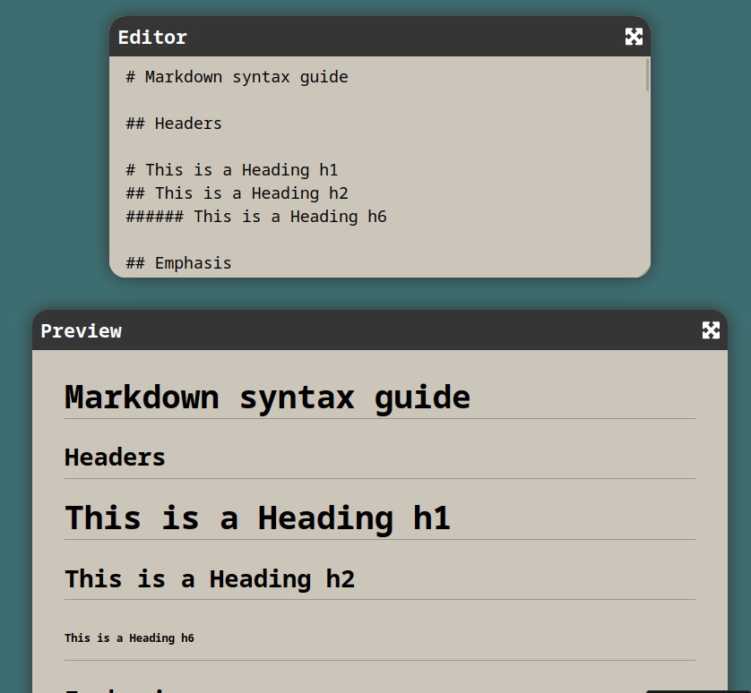

# Markdown Previewer

Check out your writing once you've added the Markdown syntax.

## Install

    $ git clone https://github.com/sobczyk-m/Markdown-Previewer.git
    $ cd Markdown-Previewer
    $ npm install

## Running the project

    $ npm start

## Preview:

## Try it here:

https://zd9r94.csb.app/

## Live code:

https://codesandbox.io/s/zd9r94